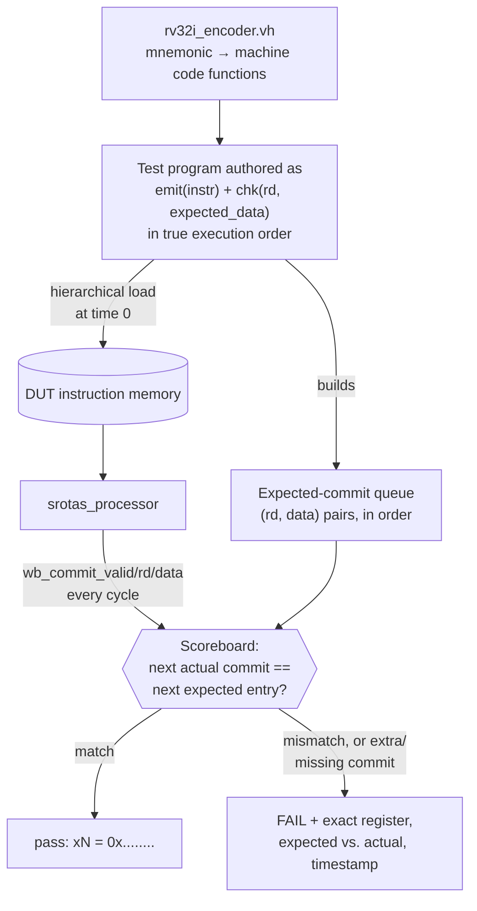
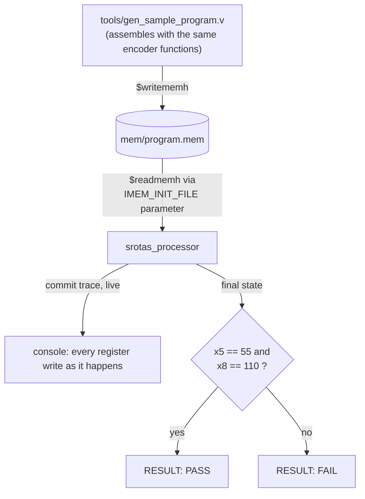

# Srotas

A synthesis-ready RISC-V processor implementing the **RV32I
base integer ISA** with a classic 5-stage in-order pipeline —
**IF → ID → EX → MEM → WB** — full data forwarding, load-use hazard
stalling, and branch/jump resolution with pipeline squash.


### About the name

**Srotas** (स्रोतस्) is Sanskrit for "flow" or "stream" — a fitting name for
a pipeline: instructions enter at Fetch and flow continuously through
Decode, Execute, Memory, and Write-Back, one stage advancing every clock
cycle like water moving downstream.

## Status

| | |
|---|---|
| ISA | RV32I (all 47 base instructions) |
| Pipeline | 5-stage, in-order, single issue |
| Hazard handling | Full EX/MEM + MEM/WB forwarding, register-file bypass, 1-cycle load-use stall |
| Control hazards | Branch/jump resolved in EX, 2-instruction squash, same-cycle redirect |
| Directed regression | **94 / 94 checks passing** |
| Verified in | Icarus Verilog **and** Xilinx Vivado 2025.2 (`xvlog`/`xelab`/`xsim`) |
| Synthesis | Clean elaboration, no latches, no `$readmemh` full-array resets (BRAM-friendly) |

## What it can do

Runs any program built from the RV32I base instruction set:

| Class | Instructions |
|---|---|
| Register-register ALU | `add sub sll slt sltu xor srl sra or and` |
| Register-immediate ALU | `addi slti sltiu xori ori andi slli srli srai` |
| Upper immediate | `lui auipc` |
| Loads | `lb lh lw lbu lhu` (signed and zero-extended) |
| Stores | `sb sh sw` |
| Branches | `beq bne blt bge bltu bgeu` |
| Jumps | `jal jalr` (subroutine call/return, correct link value) |

Every one of these is individually exercised by the test suite below —
not just decoded, but checked against the exact value it should produce.

## Architecture

```mermaid
flowchart LR
    %% ---------- IF ----------
    subgraph IF["IF — Instruction Fetch"]
        direction TB
        PCMUX{{"Next-PC MUX"}}
        PCREG["PC Register"]
        ADD4["PC + 4"]
        IMEM[("Instruction<br/>Memory")]

        PCMUX -->|"pc_next"| PCREG
        PCREG -->|"pc_current"| ADD4
        PCREG -->|"instruction address"| IMEM
        ADD4 -->|"sequential PC+4"| PCMUX
    end

    IFID[["IF/ID Register<br/>PC · PC+4 · instruction"]]
    PCREG -->|"PC"| IFID
    ADD4 -->|"PC+4"| IFID
    IMEM -->|"instruction"| IFID

    %% ---------- ID ----------
    subgraph ID["ID — Instruction Decode"]
        direction TB
        CU["Control Unit"]
        RF["Register File"]
        IMM["Immediate / Sign Extend"]
    end

    IDEX[["ID/EX Register<br/>PC · PC+4 · rs1/rs2 addresses · rs1/rs2 data · immediate · funct3 · controls"]]
    IFID -->|"opcode"| CU
    IFID -->|"rs1, rs2, rd"| RF
    IFID -->|"instruction"| IMM
    IFID -->|"PC, PC+4"| IDEX
    CU -->|"control signals"| IDEX
    RF -->|"rs1 data, rs2 data"| IDEX
    IMM -->|"immediate"| IDEX

    %% ---------- EX ----------
    subgraph EX["EX — Execute"]
        direction TB
        FWA{{"Forward A<br/>(ID/EX · EX/MEM · WB)"}}
        FWB{{"Forward B<br/>(ID/EX · EX/MEM · WB)"}}
        ASELA{{"Operand-A Select<br/>(PC · 0 · rs1_fwd)"}}
        ASELB{{"Operand-B Select<br/>(rs2_fwd · immediate)"}}
        ALU["ALU"]
        BU["Branch / Jump Unit"]

        FWA --> ASELA --> ALU
        FWB --> ASELB --> ALU
        ALU -->|"ALU result / zero"| BU
    end

    EXMEM[["EX/MEM Register<br/>PC+4 · ALU result · store data · rd · funct3 · controls"]]
    IDEX -->|"rs1 address/data"| FWA
    IDEX -->|"rs2 address/data"| FWB
    IDEX -->|"PC"| ASELA
    IDEX -->|"immediate"| ASELB
    IDEX -->|"PC, immediate, funct3,<br/>branch, jump, JALR"| BU
    ALU -->|"ALU result"| EXMEM

    %% ---------- MEM ----------
    subgraph MEM["MEM — Memory Access"]
        direction TB
        DMEM[("Data<br/>Memory")]
    end

    MEMWB[["MEM/WB Register<br/>PC+4 · ALU result · memory data · rd · controls"]]
    EXMEM -->|"address · store data · MemRead · MemWrite · funct3"| DMEM
    EXMEM -->|"PC+4 · ALU result · rd · RegWrite · ResultSrc"| MEMWB
    DMEM -->|"load data"| MEMWB

    %% ---------- WB ----------
    subgraph WB["WB — Write Back"]
        direction TB
        WM{{"Result MUX<br/>(ALU · memory · PC+4)"}}
    end

    MEMWB -->|"ALU result"| WM
    MEMWB -->|"memory read data"| WM
    MEMWB -->|"PC+4 link value"| WM
    WM -->|"final wb_data · rd · RegWrite"| RF

    %% ---------- Hazard and forwarding ----------
    HDU["Hazard / Forward Unit<br/><br/>Load-use interlock:<br/>stall PC + IF/ID, flush ID/EX<br/><br/>Forwarding priority:<br/>EX/MEM over MEM/WB"]
    IFID -.->|"id_rs1, id_rs2"| HDU
    IDEX -.->|"id_ex_rs1, id_ex_rs2,<br/>id_ex_rd, id_ex_mem_read"| HDU
    EXMEM -.->|"ex_mem_rd, ex_mem_RegWrite"| HDU
    WM -.->|"final_wb_rd, final_wb_RegWrite"| HDU

    HDU -.->|"pc_write_en"| PCREG
    HDU -.->|"if_id_write_en,<br/>if_id_flush"| IFID
    HDU -.->|"id_ex_flush"| IDEX
    HDU -.->|"forward_a"| FWA
    HDU -.->|"forward_b"| FWB

    %% EX/MEM forwarding never uses a load result.
    EXFWD["EX/MEM forward source<br/>(ALU result or PC+4 link)"]
    EXMEM --> EXFWD
    EXFWD -.->|"fwd_exmem_data"| FWA
    EXFWD -.->|"fwd_exmem_data"| FWB

    %% A load is stalled, then available through the final WB value.
    WM -.->|"fwd_memwb_data<br/>(final writeback value)"| FWA
    WM -.->|"fwd_memwb_data<br/>(final writeback value)"| FWB

    %% Control hazards
    BU -->|"redirect target"| PCMUX
    BU -.->|"ex_redirect"| HDU

    classDef pipeline fill:#fff1c5,stroke:#917536,color:#3e3212;
    classDef unit fill:#dceafa,stroke:#172f4a,color:#102d49;
    classDef memory fill:#d3e4f6,stroke:#172f4a,color:#102d49;
    classDef mux fill:#eedcf7,stroke:#6b4a80,color:#352142;
    classDef hazard fill:#d7f0ed,stroke:#21766d,color:#124e48;

    class IFID,IDEX,EXMEM,MEMWB pipeline;
    class PCREG,ADD4,CU,RF,IMM,ALU,BU,ASELA,ASELB unit;
    class IMEM,DMEM memory;
    class PCMUX,FWA,FWB,WM mux;
    class HDU,EXFWD hazard;
```



- **PC MUX** selects `PC+4` vs. `branch_target` on `branch_redirect` — the
  redirect condition (`jump`, or `branch && branch_taken`) is computed in
  `branch_unit.v`; a not-taken branch never touches this mux at all.
- **ForwardA and ForwardB are two independent muxes**, one per ALU operand,
  each with its own 3-way select (`00`=un-forwarded ID/EX value,
  `01`=EX/MEM, `10`=MEM/WB) — not a single shared mux. `EX/MEM` wins if it
  and `MEM/WB` would otherwise both match the same register, since it's the
  more recent producer.
- **The MEM/WB forward source is the actual final writeback value**
  (`fwd_memwb_data = final_wb_rd_data`, i.e. whatever the WB stage's own
  ALU/memory/link mux resolved to) — not a raw internal MEM/WB register
  field, which for e.g. a JAL producer would be architecturally wrong.
- **Load-use hazard detection is a separate concern from forwarding**,
  even though one `hazard_detection_unit` module computes both: it compares
  the *decode-stage* instruction's source registers against the *EX-stage*
  instruction's destination and `mem_read` flag — one cycle earlier in the
  pipeline than where the forwarding comparison happens — because by the
  time a load's data would be forwardable, it's already too late to avoid
  a wrong read; the only fix at that point is a 1-cycle stall.
- **3-instructions-apart hazard** (producer in WB exactly when the consumer
  is in ID) is handled inside the register file itself, with a same-cycle
  write-then-read bypass — the classic "write in the first half of the
  cycle, read in the second half" trick — since by then both the
  forwarding unit's and the load-use detector's windows have moved past.
- **Branches/jumps** resolve in EX. A taken branch or jump redirects the PC
  and squashes the two wrong-path instructions already fetched (in IF and
  ID) the same cycle.
- **Memories** are separate instruction and data RAMs (Harvard-style)
  living inside the IF and MEM stages, sized and optionally preloaded via
  Verilog parameters — no external memory ports to wire up.

### Hazards in action (real waveform behavior, not a claim)

Three concrete cases, cycle-by-cycle, as the pipeline actually runs them:

**Back-to-back dependent instructions — forwarded, zero stall cycles**
```
addi x20, x0, 1        IF  ID  EX  MEM WB
add  x20, x20, x20      .  IF  ID  EX  MEM WB   <- EX/MEM forward supplies x20
add  x20, x20, x20      .   .  IF  ID  EX  MEM WB   <- forward again, every cycle
```
Verified: the accumulator chain in the test suite (`1 → 2 → 4 → 8 → 16 → 32`)
commits one write per cycle with no gaps — confirmed against the simulation
log, where each commit lands exactly 10ns (one clock period) after the last.

**Load immediately followed by its consumer — one stall cycle**
```
lw   x17, 0(x2)         IF  ID  EX  MEM WB
add  x18, x17, x0        .  IF  ID  **   EX  MEM WB   <- bubble inserted, then forwarded
```
Verified: these two commits land 20ns apart (two cycles) instead of the
usual 10ns — exactly one bubble, as designed, and the result is still
correct because the stalled instruction picks up the value via EX/MEM
forwarding once the load reaches MEM.

**Taken branch — 2 wrong-path instructions squashed, redirect same cycle**
```
beq  x1, x2, TARGET     IF  ID  EX          <- resolved here, PC redirected this cycle
addi x3, x0, 999         .  IF  **                <- squashed (was in ID)
addi x3, x0, 999          .   .  --                <- squashed (was being fetched)
TARGET:
addi x24, x0, 111             .   .  IF  ID  EX  MEM WB
```
Verified: with a poison value (`999`) that would be unmistakable if either
squashed instruction ever committed, and it never does — the scoreboard
would flag it immediately as an unexpected commit if the squash logic
ever failed.

## Testing

Two testbenches, built around a `wb_commit_valid/rd/data` debug port that
reports every real architectural register write as it retires — this is
what both testbenches watch instead of peeking at internal state.

### `tb_isa_directed.v` — the regression



Because this pipeline is strictly in-order and single-issue, "the next
commit the DUT produces" must equal "the next expected entry in program
order" if — and only if — hazards, forwarding, and squashing are all
correct. A missing commit, an extra commit (e.g. a squashed instruction
leaking through), or a wrong value are all caught the same way: compared
against the next item in the queue.

**Coverage (94 checks):**

| Section | What it proves |
|---|---|
| A. R-type ALU + forwarding stress | Every register-register op; adjacent instructions with 1- and 2-apart dependencies |
| B. I-type ALU | Every register-immediate op, including shift-amount encoding |
| C. LUI / AUIPC | Upper-immediate construction, PC-relative computation |
| D. Loads/stores, all widths | Signed and zero-extended byte/half/word; store-data forwarding |
| E. Load-use hazard | The one case forwarding can't fix — exactly one stall cycle |
| F. Register-file bypass | Producer exactly 3 instructions ahead of consumer (WB-to-ID same cycle) |
| G. All 6 branch types | Taken (with 2-instruction squash verification) and not-taken |
| H. JAL / JALR | Subroutine call, correct link value, correct return |
| I. Forwarding-priority stress | Self-referential accumulator — closer (EX/MEM) source must beat farther (MEM/WB) source |
| J. Backward branch (real loop) | 10-iteration loop, sum 1..10, the only *backward* redirect test |

### `tb_program.v` — the "run your own program" template



The bundled program sums 1..10 via a real backward-branch loop, doubles it,
and stores both results to data memory — small enough to read in full below,
comprehensive enough to exercise a loop, ALU ops, and load/store together.
This is the file to copy and point at your own `.mem` (see
[Running your own program](#running-your-own-program)).

### Results

```
$ vvp tb_isa_directed.out            (Icarus Verilog)
========================================
RESULT: ALL 94 CHECKS PASSED
========================================

$ xsim tb_isa_directed_snap ...      (Vivado 2025.2 xsim)
========================================
RESULT: ALL 94 CHECKS PASSED
========================================

$ vvp tb_program.out / xsim tb_program_snap ...
x5  (sum)      = 55  (0x00000037)
x8  (sum * 2)  = 110 (0x0000006e)
RESULT: PASS (sum(1..10) = 55, doubled = 110)
```

Both testbenches were compiled, elaborated, and run through **both**
Icarus Verilog and Xilinx Vivado 2025.2's own `xvlog`/`xelab`/`xsim`
binaries — including via the exact source layout Vivado's project flow
produces (`add_files`, filesets, the auto-exported memory-init file) — with
identical results in both tools.

## Directory layout

```
src/
  common/        rv32i_defines.vh   - shared opcode/ALU-op/immediate encodings
  if_stage/       PC, instruction memory, IF/ID register
  id_stage/       register file, control unit, sign extend, ID/EX register
  ex_stage/       ALU, branch/jump unit, EX/MEM register
  mem_stage/      data memory, MEM/WB register
  wb_stage/       writeback mux
  top_level/      srotas_processor.v (top module), hazard_detection.v
  testbenches/    rv32i_encoder.vh, tb_isa_directed.v, tb_program.v
mem/             program.mem - sample compiled program (see below)
tools/           gen_sample_program.v - the script that produced program.mem
vivado/          create_project.tcl - one-shot Vivado project generator
docs/            Notes from the original build
```

## Running the tests yourself

### Icarus Verilog

```bash
# Full directed regression (94 self-checking assertions)
iverilog -I src/common -I src/testbenches -o sim.out -s tb_isa_directed \
  src/if_stage/*.v src/id_stage/*.v src/ex_stage/*.v src/mem_stage/*.v \
  src/wb_stage/*.v src/top_level/hazard_detection.v src/top_level/srotas_processor.v \
  src/testbenches/tb_isa_directed.v
vvp sim.out

# Sample program demo (must run with the working directory containing
# program.mem, since that's where $readmemh looks for it - see note below)
iverilog -I src/common -I src/testbenches -o sim2.out -s tb_program \
  src/if_stage/*.v src/id_stage/*.v src/ex_stage/*.v src/mem_stage/*.v \
  src/wb_stage/*.v src/top_level/hazard_detection.v src/top_level/srotas_processor.v \
  src/testbenches/tb_program.v
cp sim2.out mem/ && cd mem && vvp sim2.out && cd ..
```

Both should end with `RESULT: ALL 94 CHECKS PASSED` / `RESULT: PASS`.

### Vivado

You have two ways to run it; both were used to verify this design.

**1. Project flow (recommended - matches how a student would actually use it):**

```tcl
cd path/to/Srotas
source vivado/create_project.tcl
```

This creates a project, adds all RTL as synthesis sources, adds both
testbenches as simulation sources, marks `mem/program.mem` as a memory
initialization file (Vivado auto-exports it into the simulation run
directory), and sets `tb_program` as the simulation top. Then, in the Flow
Navigator: **Run Simulation → Run Behavioral Simulation**.

To run the full 94-check regression instead:
```tcl
set_property top tb_isa_directed [get_filesets sim_1]
launch_simulation
```

**2. Command-line flow** (`xvlog`/`xelab`/`xsim`, useful for scripting/CI):
```bash
xvlog -i src/common -i src/testbenches src/if_stage/*.v src/id_stage/*.v \
  src/ex_stage/*.v src/mem_stage/*.v src/wb_stage/*.v \
  src/top_level/hazard_detection.v src/top_level/srotas_processor.v \
  src/testbenches/tb_isa_directed.v
xelab tb_isa_directed -s tb_isa_directed_snap
xsim tb_isa_directed_snap -R
```

## Running your own program

`srotas_processor` takes `IMEM_INIT_FILE` (and optionally `DMEM_INIT_FILE`)
as parameters, loaded with `$readmemh` — one 32-bit hex instruction word per
line, e.g.:

```
00000293
00100313
...
```

**Important:** `$readmemh` resolves its path relative to the simulator's
working directory *at run time*, in both Icarus and Vivado — not relative
to the source file. This was confirmed by testing both tools directly:
Vivado's project flow auto-copies a file marked "Memory Initialization
File" into the xsim run directory using its bare filename (dropping any
subfolder), which is exactly why the bundled `program.mem` is referenced
as `"program.mem"`, not `"mem/program.mem"`, in `tb_program.v`. If you add
your own `.mem` file, either drop it in the same folder your simulator
runs from, or edit `IMEM_INIT_FILE` to an absolute path.

Point it at your file by editing `PROGRAM_FILE` at the top of
`src/testbenches/tb_program.v`, or by instantiating the processor yourself:

```verilog
srotas_processor #(
    .IMEM_INIT_FILE("your_program.mem")
) dut (
    .clk(clk), .rst_n(rst_n),
    .wb_commit_valid(), .wb_commit_rd(), .wb_commit_data(), .if_pc_debug()
);
```

To produce a `.mem` file:
- **From a real toolchain**: assemble/compile with the RISC-V GNU
  toolchain (`-march=rv32i`), then extract the raw instruction words and
  format them as one hex word per line (e.g. via `objcopy` to a flat binary
  followed by a short reformat, or `elf2hex`).
- **By hand for a small program**: use the encoder functions in
  `src/testbenches/rv32i_encoder.vh` the way `tools/gen_sample_program.v`
  does, and `$writememh` the result.

The processor only implements the base RV32I integer ISA — no compressed
(C), multiply/divide (M), CSRs, exceptions, or interrupts — so a compiled
program must target `-march=rv32i` and avoid anything that needs an OS or
those extensions.

## Known limitations (current scope, for a single hobby-scale in-order core)

- No branch prediction — every taken branch/jump costs a 2-cycle bubble.
- No exceptions, interrupts, or CSRs.
- No M-extension (multiply/divide) or C-extension (compressed instructions).
- Single outstanding memory access per cycle, no caches.

None of these are permanent limits, just what v1 covers — see below.

## Contributing

This started as a learning project and is very much still growing.
Branch prediction, the M/C extensions, exceptions and CSRs, caches, and an
FPGA bring-up on real hardware are all natural next steps, and they're
deliberately left as future releases rather than tackled all at once.

Contributions, issues, and ideas are welcome from anyone — whether that's
fixing a bug, adding a feature from the list above, extending the test
suite, or just asking a question. If you're extending the ISA support or
the pipeline itself, the directed regression in `tb_isa_directed.v` is the
place to add new checks alongside your change, the same way every existing
feature is verified.
